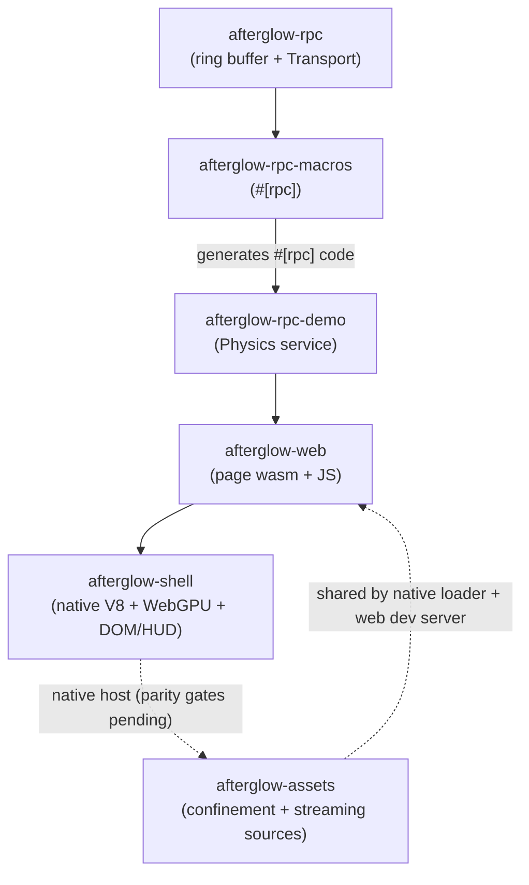

# Crate Map

The workspace's crates and how they relate. The `Cargo.toml` is the source of
truth.

| Crate | Purpose |
|---|---|
| `afterglow-rpc` | Core: `RingBuffer`, `Transport` trait, postcard codec, `Response` envelope. The `native` module has `RingStorage`, `spawn_worker_loop`, `run_worker_loop`, and event rings. |
| `afterglow-rpc-macros` | The `#[rpc]` proc macro: generates the server trait, typed Rust client, dispatch, native spawn, and thin wasm exports. |
| `afterglow-rpc-demo` | Demo `Physics` service + `bench_rpc` stress test. The reference example of a `#[rpc(worker = ...)]` service. |
| `afterglow-assets` | Shared confinement/MIME plus positional streaming primitives (`AssetSource`, `FsSource`, `BytesSource`) and bounded range parsing. The single security boundary for FS assets. |
| `afterglow-assets-worker` | Generated async `load`/`size`/`read` service. Native builds use `FsSource`; the live browser BIG/VT path currently uses the serving-layer range loader instead. |
| `afterglow-basis-encoder` | Offline-only UASTC encoder used by the asset pipeline; isolates the official C++ Basis encoder from runtime and wasm crates. |
| `afterglow-pipeline` | Confines/embeds external glTF packages, packs self-contained GLBs, extracts images, cooks resident 8-bit R8 displacement + blue-noise dither textures into `.big` containers, builds bordered VT pages and packed mip tails, UASTC-encodes slots, and writes seekable `.big` containers. |
| `afterglow-texture` | Pure-Rust runtime worker that transcodes Basis pages to BC7, ASTC, ETC, or RGBA. Public web uses its WASM worker; the native shell must use its generated native worker, but that composition is not yet wired (see `docs/implementation/shell-promotion-plan.md`). |
| `afterglow-web` | Wasm target and authored TypeScript runtime: shared-ring workers, packed model loading, rig-preserving runtime meshopt, VT materials/feedback, fixed engine memory, and demos. |
| `afterglow-shell` | The sole native Three.js/WebGPU runtime: rusty_v8 + Deno WebGPU, winit/wgpu presentation, LinkeDOM/Blitz browser environment, and Vello GPU HUD. Native worker composition, asset-root loading, and a production game bootstrap API are open parity gates. |
| `latency-tool` | CDP-based input→present latency measurement. |
| `xtask` | Build orchestrator: `build`, `wasm`, `check`, `test`, `bench`. |

## How they relate



- **`afterglow-rpc`** is the foundation: the ring primitive, the `Transport`
  trait, the postcard codec, the `Response` envelope.
- **`afterglow-rpc-macros`** turns a trait into a server + client + (optionally)
  native spawn / wasm exports.
- **`afterglow-rpc-demo`** is the canonical example: a `Physics` service defined
  once, runnable as a native thread or a wasm worker.
- **`afterglow-web`** is the web transport — page-side wasm exports + the JS
  worker/client.
- **`afterglow-shell`** is the sole native host — it runs unmodified Three.js
  modules in rusty_v8 and shares one wgpu device between JavaScript rendering,
  native presentation, and the Vello DOM HUD. `afterglow-cef` has been removed;
  remaining parity work is tracked in `docs/implementation/shell-promotion-plan.md`.
- **`afterglow-assets`** is the shared security boundary and positional-byte
  primitive for serving filesystem assets, used by the web dev server (and,
  once the G1 gate lands, the native shell loader).

## The `xtask` orchestrator

```sh
cargo run -p xtask build   # build the afterglow-shell native host
cargo run -p xtask wasm    # build wasm, stage web inputs, and regenerate www/
cargo run -p xtask check   # cargo check the whole workspace
cargo run -p xtask test    # cargo test --workspace + node --test on rpc.test.mjs
cargo run -p xtask bench   # run the native ring buffer stress test
```

## Where to start in the code

| You want to | Look at |
|---|---|
| Run the native shell | `crates/afterglow-shell/src/main.rs` |
| Understand asset serving | `crates/afterglow-assets/`, `crates/afterglow-web/src/dev_server.rs` |
| See a worker service | `crates/afterglow-rpc-demo/src/lib.rs` |
| Use the `#[rpc]` macro | `crates/afterglow-rpc-macros/src/lib.rs` |
| Call a worker from TypeScript | `crates/afterglow-web/web/src/workers/` |
| Build wasm | `xtask/src/main.rs`, `.cargo/config.toml` |
