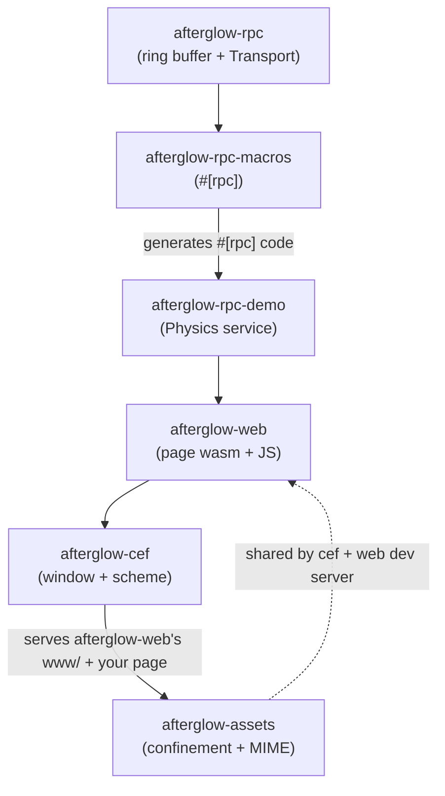

# Crate Map

The workspace's crates and how they relate. The `Cargo.toml` is the source of
truth.

| Crate | Purpose |
|---|---|
| `afterglow-rpc` | Core: `RingBuffer`, `Transport` trait, postcard codec, `Response` envelope. The `native` module has `RingStorage`, `spawn_worker_loop`, `run_worker_loop`, and event rings. |
| `afterglow-rpc-macros` | The `#[rpc]` proc macro: generates the server trait, typed Rust client, dispatch, native spawn, and thin wasm exports. |
| `afterglow-rpc-demo` | Demo `Physics` service + `bench_rpc` stress test. The reference example of a `#[rpc(worker = ...)]` service. |
| `afterglow-assets` | Shared asset-path/MIME helpers (`AssetRoot`, `guess_mime`, `resolve`). The single security boundary for FS asset confinement. |
| `afterglow-basis-encoder` | Offline-only UASTC encoder used by the asset pipeline; isolates the official C++ Basis encoder from runtime and wasm crates. |
| `afterglow-pipeline` | Confines/embeds external glTF packages, packs self-contained GLBs, extracts images, emits lossless single-channel R16 displacement payloads, builds bordered VT pages and packed mip tails, UASTC-encodes slots, and writes seekable `.big` containers. |
| `afterglow-texture` | Pure-Rust runtime worker that transcodes Basis pages to BC7, ASTC, ETC, or RGBA. |
| `afterglow-web` | Wasm target and authored TypeScript runtime: shared-ring workers, packed model loading, rig-preserving runtime meshopt, VT materials/feedback, fixed engine memory, and demos. |
| `afterglow-cef` | Thin CEF shell: window + WebGPU flags + `afterglow://` scheme + COOP/COEP headers. No worker code, no IPC, no input. |
| `latency-tool` | CDP-based input→present latency measurement. |
| `xtask` | Build orchestrator: `build`, `wasm`, `check`, `test`, `bench`. |

## How they relate



- **`afterglow-rpc`** is the foundation: the ring primitive, the `Transport`
  trait, the postcard codec, the `Response` envelope.
- **`afterglow-rpc-macros`** turns a trait into a server + client + (optionally)
  native spawn / wasm exports.
- **`afterglow-rpc-demo`** is the canonical example: a `Physics` service defined
  once, runnable as a native thread or a wasm worker.
- **`afterglow-web`** is the web transport — page-side wasm exports + the JS
  worker/client.
- **`afterglow-cef`** is the native shell — a window with WebGPU, the
  `afterglow://` scheme, and COOP/COEP.
- **`afterglow-assets`** is the shared security boundary for serving filesystem
  assets, used by both the CEF scheme handler and the web dev server.

## The `xtask` orchestrator

```sh
cargo run -p xtask build   # build the native CEF host + examples
cargo run -p xtask wasm    # build wasm, stage web inputs, and regenerate www/
cargo run -p xtask check   # cargo check the whole workspace
cargo run -p xtask test    # cargo test --workspace + node --test on rpc.test.mjs
cargo run -p xtask bench   # run the native ring buffer stress test
```

## Where to start in the code

| You want to | Look at |
|---|---|
| Configure a window | `crates/afterglow-cef/src/config.rs` (`AppBuilder`) |
| Understand asset serving | `crates/afterglow-cef/src/resources.rs`, `crates/afterglow-assets/` |
| See a worker service | `crates/afterglow-rpc-demo/src/lib.rs` |
| Use the `#[rpc]` macro | `crates/afterglow-rpc-macros/src/lib.rs` |
| Call a worker from TypeScript | `crates/afterglow-web/web/src/workers/` |
| Build wasm | `xtask/src/main.rs`, `.cargo/config.toml` |
